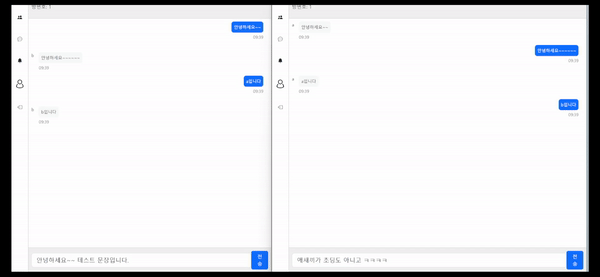

# 채팅 서비스
Bert를 이용한 비속어 탐지 AI가 적용된 실시간 양방향 채팅 서비스

## Demo

### 스크린샷

|                                    로그인                                    |                                        알람                                        |
|:-------------------------------------------------------------------------:|:--------------------------------------------------------------------------------:|
|  |  |

|                                    친구초대                                    |                                     회원가입                                     |
|:--------------------------------------------------------------------------:|:----------------------------------------------------------------------------:|
|  |  |

### 채팅 영상


### 비속어 감지
- 모두에게 `비속어 탐지중...`이 나온다.
  - 비속어가 아닌 경우: 올바르게 메시지가 보여진다.
  - 비속어인 경우:  `비속어가 감지되었습니다.`라는 alert가 표시됨



### docs

|       제목       |                        파일                        |
|:--------------:|:------------------------------------------------:|
|     API 문서     |           [📑](./backend/docs/api.md)            |
| AI 사용 데이터 및 학습 |    [📖](./ai/README.md)    |
|  AI 실제 학습 코드   | [📑](./ai/BERT_korean_profanity_detection.ipynb) |
|                |                                                  |

## Steps to Setup

### Requirements

`java - 17`, `maven - 4.0.0`, `node - 20.13.1`

### Local

#### AI

[🔗 비속어 탐지 onnx 모델 다운로드 링크](https://drive.google.com/file/d/1rRRN_0KcAvmQamEB-2bD5QZttj9zrRy9/view)</br>
위 파일을 다운로드 후 spring-boot의 resources에 파일명을 `model.onnx`로 변경해 넣는다.

#### Backend

```bash
mvn spring-boot:run
```

#### Frontend

```bash
npm install
npm start
```

```
http://localhost:3000/
```

### Azure

## Architeucture

## 학습 내역

### AI

| 제목          |            학습내역            |
|:------------|:--------------------------:|
| BERT 모델 소개  | [📖](./ai/BERT%20model.md) |
| 사용 데이터 및 학습 |    [📖](./ai/README.md)    |
|             |                            |

### backend

| 제목                                                                  |                   학습 내역                    |
|:--------------------------------------------------------------------|:------------------------------------------:|
| 비동기 처리와 약한 결합을 위한 `event`학습 - event, publish, listeners             |    [📖](./backend/docs/study/event.md)     |
| JWT authentication 구현 마스터하기!                                        |    [📖](./backend/docs/study/token.md)     |
| 채팅 구현을 위한 STOMP 사용 방법                                               | [📖](./backend/docs/study/spring-stomp.md) |
| Spring WebFulx - sync, async와 blocking, nonblocking부터 webflux 사용법까지 |   [📖](./backend/docs/study/webflex.md)    |
|                                                                     |                                            |

### frontend

| 제목                                           |                         학습 내역                          |
|:---------------------------------------------|:------------------------------------------------------:|
| react에서 api 사용하기 - fetch, axios              |      [📖](./frontend/docs/study/consume-apis.md)       |
| react에서 navigation하기 - react router dom 사용법  |         [📖](./frontend/docs/study/router.md)          |
| context API로 props drilling 해결 및 data shring |         [📖](./frontend/docs/study/context.md)         |
| websocket의 필요와 connection                    | [📖](./frontend/docs/study/websocket-and-filtering.md) |
|                                              |                                                        |

---
이 문서와 코드는 [KSY(HwiYul-G)](https://github.com/HwiYul-G)에 의해 작성되었습니다. 클론 시 꼭 표기 부탁드립니다. </br>
This document and code were written by [KSY(HwiYul-G)](https://github.com/HwiYul-G). Please be sure to indicate this
when cloning