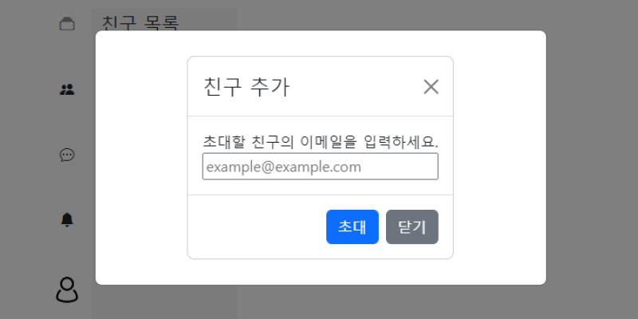

# 채팅 서비스
실시간 양방향 소통을 구현해보기 위한 채팅 서비스
## Demo
### 스크린샷
|로그인|알람|
|:--:|:--:|
|||

|친구초대|회원가입|
|:--:|:--:|
|||

### 채팅 영상


### API docs
|제목| 파일|
|:--:|:--:|
|API 문서|[📑](./backend/docs/api.md)|

## Steps to Setup
### Requirements
`java - 17`, `maven - 4.0.0`, `node - 20.13.1`
### Local
#### Backend
```bash
mvn spring-boot:run
```
#### Frontend
```bash
npm install
npm start
```
```
http://localhost:3000/
```

### Azure

## Architeucture

## 학습 내역
### backend
|제목|학습 내역|
|:--|:--:|
|비동기 처리와 약한 결합을 위한 `event`학습 - event, publish, listeners|[📖](./backend/docs/study/event.md)|
|JWT authentication 구현 마스터하기!|[📖](./backend/docs/study/token.md)|
|채팅 구현을 위한 STOMP 사용 방법|[📖](./backend/docs/study/spring-stomp.md)|
| Spring WebFulx - sync, async와 blocking, nonblocking부터 webflux 사용법까지 |[📖](./backend/docs/study/webflex.md)|
|||

### frontend
|제목|학습 내역|
|:--|:--:|
|react에서 api 사용하기 - fetch, axios|[📖](./frontend/docs/study/consume-apis.md)|
|react에서 navigation하기 - react router dom 사용법|[📖](./frontend/docs/study/router.md)|
|context API로 props drilling 해결 및 data shring|[📖](./frontend/docs/study/context.md)|
|websocket의 필요와 connection|[📖](./frontend/docs/study/websocket-and-filtering.md)|
|||


---
이 문서와 코드는 [KSY(HwiYul-G)](https://github.com/HwiYul-G)에 의해 작성되었습니다. 클론 시 꼭 표기 부탁드립니다. </br>
This document and code were written by [KSY(HwiYul-G)](https://github.com/HwiYul-G). Please be sure to indicate this when cloning