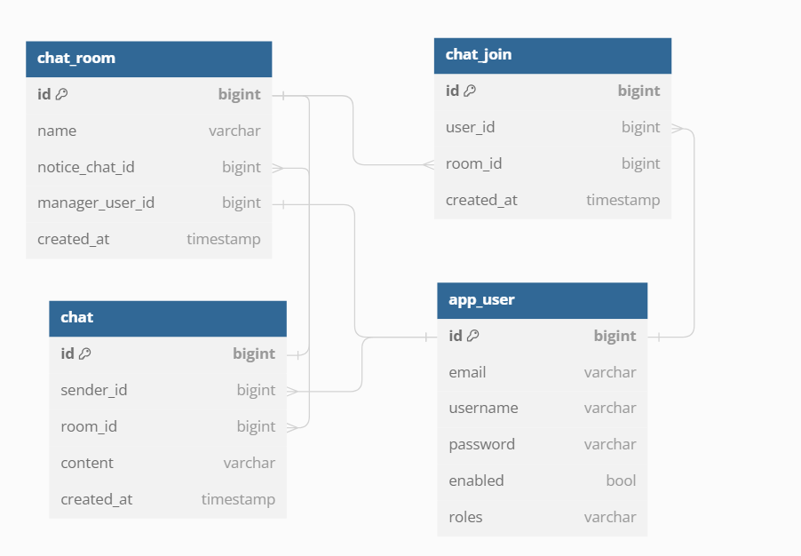

## Development Process
- Requirements -> Planning -> Design -> Implementation and Testing -> Deployment
  - Requirements : User Stories
  - Planning : GitHub Issues
  - Design : API-First Approach
  - Implementation and Testing : TDD
  - Deployment : CI/CD

### Requirements
#### As a `<user role>`, I want `<goal>`, so that `<rationale>`.
- 게스트는 회원가입을 할 수 있다.
- 로그인한 사용자가 사용자 닉네임으로 친구 추가를 한다.
- 로그인한 사용자가 친구 추가 허가를 한다.
- 로그인한 사용자가 친구에게 1:1 대화를 걸 수 있다.
- 로그인한 사용자는 오픈 채팅방을 만들 수 있다.
  - 오픈 채팅방을 만든 사용자는 해당 방의 관리자가 된다.
  - 오픈 채팅방 관리자는 그 방의 모든 사용자의 채팅 내용을 가리기 할 수 있다.
  - 오픈 채팅방 관리자는 특정 사용자를 강퇴할 수 있다.
- 로그인한 사용자는 오픈 채팅방에 들어갈 수 있다.
- 로그인한 사용자는 오픈 채팅방에서 나올 수 있다.

### Planning
- Requirements를 구체화해서 github issues에 등록한다.

### Design
- API-First Approach
  - 코드 한 줄을 작성하기 전에 API 문서를 개발한다.
  - api doc은 front-end와 back-end 사이의 계약이다.
- API-First Approach의 장점
  - 더 나은 커뮤니케이션과 collaboration
  - 더 나은 개발자 경험
  - 빠른 개발


## ERD
- [dbdiagram.io](https://dbdiagram.io/d)



<details>
  <summary> 현재 ERD 정의 코드</summary>

```
Table app_user {
id bigint [primary key]
email varchar
username varchar
password varchar
enabled bool
roles varchar
}

Table chat {
id bigint [primary key]
sender_id bigint
room_id bigint
content varchar
created_at timestamp
}

Table chat_room{
id bigint [primary key]
name varchar
notice_chat_id bigint
manager_user_id bigint [ref: - app_user.id]
created_at timestamp
}

Table chat_join{
id bigint [primary key]
user_id bigint
room_id bigint
created_at timestamp
}


Ref: chat.sender_id > app_user.id // many-to-one
Ref: chat.room_id > chat_room.id
Ref: chat_room.notice_chat_id > chat.id
Ref: chat_join.user_id > app_user.id
Ref: chat_join.room_id > chat_room.id
```
</details>
